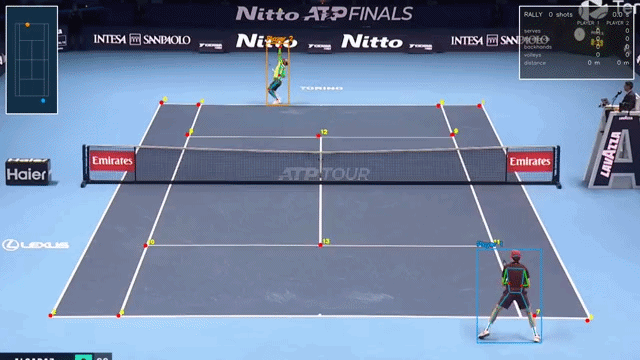

# Tennis AI

This project use Computer Vision to turn a broadcast tennis clip into a top-down map with event detection.
Rally length, shot (serve, backhand, forehand, volleys) and distance covered by both players is automatically registered.



---

## What it does

Per frame, the pipeline detects the **court** (14 keypoints), the **ball**, the
**players**, and each player's **2D pose**, then fuses them through a
ground-plane **homography** into a top-down court view. 

- **Bounce & hit detection** — the ball track is split into smooth flight
  segments by change-point detection under a physical prior.
- **Rally-grammar repair** — the rally must alternate hit / bounce. 
- **Sub-frame bounce refinement** — the true impact is where the incoming and
  outgoing image arcs meet at height 0 (where the ground-plane homography is
  exact), recovered in continuous time rather than snapped to a frame.
- **Stroke classification** — each hit is attributed to a player and typed
  forehand / backhand / serve / overhead using the contact point relative to
  the player's shoulder axis (from ViT-Pose), so the same rule
  works for the near player (back to camera) and the far player (facing it).

All of this is **deterministic geometry** 

### Headline files

| File | Role |
|------|------|
| **[`ball_events.py`](ball_events.py)** | The core: bounce/hit detection, rally-grammar repair, sub-frame refinement, stroke classification. Pure `numpy` + `cv2`, no model imports. |
| **[`main.py`](main.py)** | The pipeline: court → ball → players → pose → homography → minimap → live match-stats overlay. |
| [`match_stats.py`](match_stats.py) | Rally counter, stroke tally, distance covered. |

## Architecture

```
video ─┬─► court keypoints ─┐
       ├─► ball (TrackNet) ─┤
       ├─► players (RF-DETR)─┤──► homography ──► top-down court coords
       └─► pose (ViT-Pose) ──┘                          │
                                                        ▼
                              ball_events.py: segment → classify → grammar → strokes
                                                        │
                                                        ▼
                              minimap + bounce/stroke overlays + match stats
```

The detectors are established models (see **Attribution**); the event-detection
and stroke-classification layer on top is the original contribution.

## Quick start

```bash
# 1. Install dependencies (CUDA optional — runners fall back to CPU)
pip install -r requirements.txt

# 2. Fetch the third-party models (nothing third-party is committed here)
python setup_models.py

# 3. Run the full pipeline on your own clip
python main.py input_videos/your_clip.mp4
# -> output_videos/combined_your_clip.mp4  (+ .json with every event)
```

Bring your own footage: put an `.mp4` in `input_videos/`. 

## Attribution

This project builds on several open-source models — **court** and **ball**
detection ([yastrebksv/TennisCourtDetector](https://github.com/yastrebksv/TennisCourtDetector),
[yastrebksv/TrackNet](https://github.com/yastrebksv/TrackNet)), **pose**
([ViT-Pose](https://huggingface.co/usyd-community/vitpose-base-simple)), and
**player detection** ([RF-DETR](https://pypi.org/project/rfdetr/)); the minimap
idea is inspired by [ArtLabss/tennis-tracking](https://github.com/ArtLabss/tennis-tracking).
None of their code or weights are redistributed here — `setup_models.py` fetches
each from its original source. See **[ATTRIBUTION.md](ATTRIBUTION.md)** for the
full breakdown and licenses.

## License

Original code in this repo is [MIT licensed](LICENSE). The third-party models
fetched at setup time keep their own upstream licenses (see ATTRIBUTION.md).
